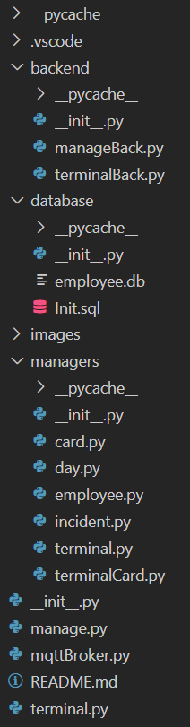

# Card employee manager

## Disclamer

In windows terminal (cmd) instead of `python3` write `python`!

## Usage

Program is divided into two parts: manager client and terminal
client. 

### Manager

Manager client 'manages' whole system, modifies 
various entries in database and allows to add new employees,
terminals, cards.

#### manager.py usage

Open terminal in main directory of project and invoke command:

`python3 manage.py -h`

This will return you basic info how to use this program

For example to add new employee with
name Grzegorz Kowalski write:

`python3 manage.py add -e Grzegorz Kowalski`

Commands to invoke:

`add [-h] [-e Name Surname] [-t terminalID] [-c cardID]`

`delete [-h] [-e employeeID] [-t terminalID] [-c cardID]`

`list [-h] {employees,incidents,days,terminals,cards}`

`raport [-h] employeeID`

`assign [-h] cardID employeeID`

`unassign [-h] cardID`

### Terminal

Used to emulate physical terminal and read card from employees, and log info to system

#### terminal.py usage

 and invoke command:

1. Open terminal in main directory of project
2. Invoke `python3 mqttBroker.py` (launches mqtt script which is used for managing connections between system and terminals)
3. Invoke `python3 terminal.py <put here number of desired terminal>`

In order to get basic help of terminal.py usage invoke: `python3 terminal.py -h`

There are two terminals available out of the box: __1__ and __2__

You can add other terminals via command 
`python3 manage.py add -t <terminalID to be added>`

In order to turn off terminal.py just write `exit`

In order to turn off mqttBroker.py press `ctrl + z`

## File system structure

### __Auto generated files and folders(.vscode, pycache, .git, init.py)__

Auto generated by IDE and python

### __backend__

Contains functions directly used in CLI. 

#### manageBack.py

Functions for manage.py file

#### terminalBack.py

Functions for terminal.py file

#### mqttBroker.py

Manages connections between system and remote terminals

### __database__

Contains direct database files 

#### employee.db

Sqlite3 database with data used in program

#### Init.sql

Used to initialise database with sample data for testing

### __images__

Images used in documentation

### __managers__

Scripts which directly communicates with sql database. They are used by __backend__ scripts

## Database

Description of tables in sqlite3 database

### __card__

Keeps info about:
1. all cards in system
2. cards employees assigment
3. wheter card was used in given day

### __day__

Keeps info about given day of certain employee

### __employee__

Keeps all employee data

### __incident__

Keeps data about all past incidents(wrong card usages)

### __terminal__

Keeps all terminal data

### __terminalCard__

Keeps data about when terminal was used and by what cardID

## Usage screenshots

## Author

* **Bartłomiej Chmiel**